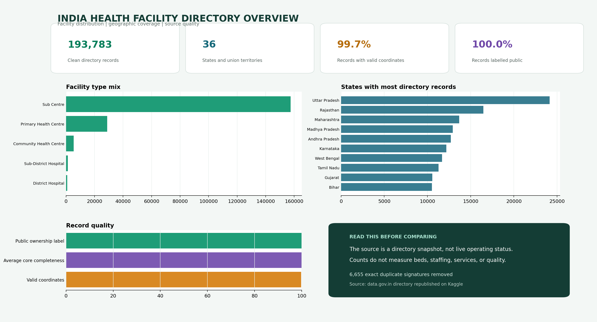

# India Public Health Facility Access Analytics

This project turns the All India Health Centres Directory into a clean facility-level analytical table and a four-page Power BI implementation plan. It focuses on facility distribution, geographic coverage, ownership labels, rural and urban mix, and source quality.



## Project question

How can a large historical government facility directory be prepared for national and state comparison without presenting directory counts as live healthcare capacity?

## Result

| Measure | Result |
| --- | ---: |
| Raw directory records | 200,438 |
| Clean facility records | 193,783 |
| Exact duplicate signatures removed | 6,655 |
| States and union territories | 36 |
| State and district combinations | 688 |
| Valid coordinates | 99.7% |
| Records labelled public | 100.0% |

The pipeline standardises five facility types, validates coordinates against an India bounding range, normalises nulls, merges an outdated Andhra Pradesh label, removes exact signatures, and publishes an auditable quality summary.

## Data source

The acquisition script downloads the [All India Health Centres Directory](https://www.kaggle.com/datasets/akshatuppal/all-india-health-centres-directory), described as an ensemble of data collected from data.gov.in. The Kaggle page states CC0 and dates the directory to 7 October 2016.

That date is essential. The dataset is useful for demonstrating preparation and geographic analysis, but it is not a live source of current facilities, staffing, beds, operating hours, or services.

## Dashboard design

The included Power BI guide defines four pages:

1. National overview with scale, coverage, facility type, and state mix
2. Geographic access explorer with state, district, and facility filters
3. State comparison matrix with coverage and quality measures
4. Data quality page with duplicates, missing fields, and coordinate checks

Reusable DAX measures are included in `dashboards/measures.dax`.

## Repository guide

| Path | Contents |
| --- | --- |
| `scripts/acquire_data.py` | Reproducible download and source manifest |
| `src/pipeline.py` | Cleaning, normalisation, coordinate validation, and deduplication |
| `src/dashboard.py` | Power BI-style visual evidence generated from the clean table |
| `dashboards` | DAX measures and four-page Power BI build guide |
| `data/processed` | Clean national facility table and quality summary |
| `docs/data_dictionary.md` | Field definitions and analytical meaning |
| `reports` | Detailed PDF project report |
| `tests` | Transformation and data-quality rule checks |

[Read the ten page project report](reports/India_Public_Health_Facility_Access_Analytics_Report.pdf)

## Reproduce

```bash
python3 -m venv .venv
source .venv/bin/activate
pip install -r requirements.txt
python scripts/acquire_data.py
python src/pipeline.py
python src/dashboard.py
python scripts/build_report.py
pytest
ruff check src scripts tests
```

## Interpretation boundary

Counts describe a historical directory snapshot. They do not measure patient access, need, emergency readiness, clinical outcomes, bed capacity, medicine availability, or quality. Population denominators and current facility validation would be required before operational use.

## Author

Harika
